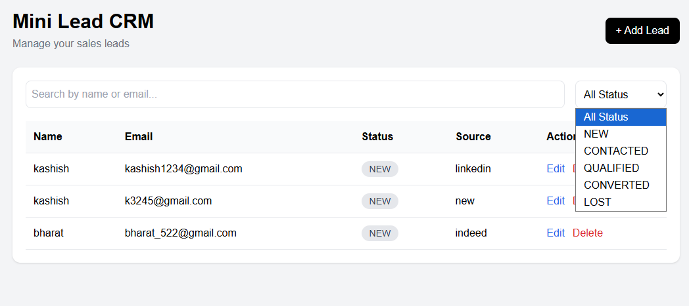
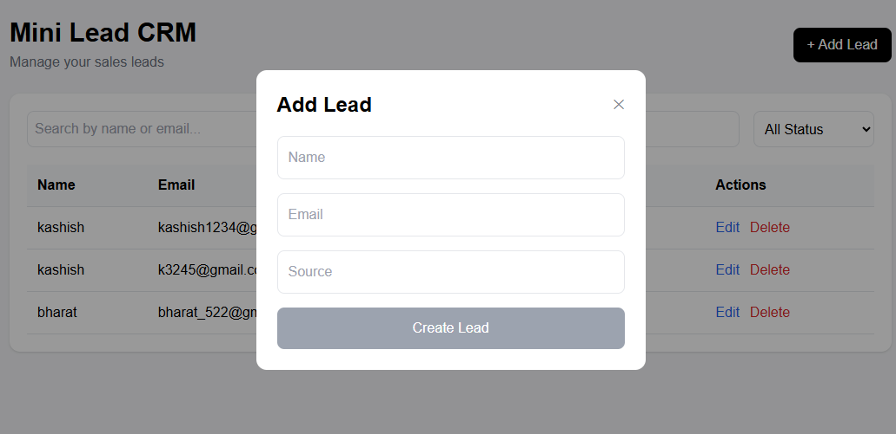
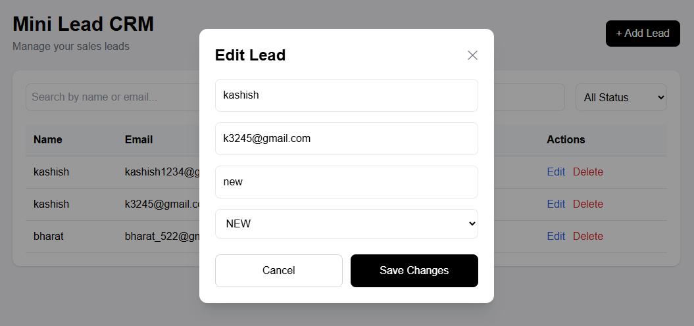

# Mini Lead CRM

A modern and responsive Lead Management CRM built using React, TypeScript, Tailwind CSS, React Query, and JSON Server.

This project helps sales teams manage potential customers (leads) efficiently through a clean dashboard interface with CRUD operations, search/filtering, and status management.

---

# Live Features
## Demo Video

<video src="https://github.com/kashish80-lang/CRM_LEADS_FRONTEND/raw/main/screenshots/demo.mp4" controls width="700"></video>

If video does not play:

[Watch Demo Video](https://github.com/kashish80-lang/CRM_LEADS_FRONTEND/raw/main/screenshots/demo.mp4)
## Lead Management

* Add new leads
* Edit lead details
* Delete leads with confirmation popup
* View all leads in a table
* Auto-refresh UI after updates

## Search & Filtering

* Search leads by:

  * Name
  * Email
* Filter leads by status:

  * NEW
  * CONTACTED
  * QUALIFIED
  * CONVERTED
  * LOST

## UI Features

* Responsive modern dashboard
* Modal-based forms
* Dynamic status badges
* Real-time updates using React Query
* Clean Tailwind CSS styling

---

# Tech Stack

| Technology      | Purpose                 |
| --------------- | ----------------------- |
| React           | Frontend Library        |
| TypeScript      | Type Safety             |
| Vite            | Fast Development Server |
| Tailwind CSS    | Styling                 |
| React Query     | API State Management    |
| React Hook Form | Form Handling           |
| Zod             | Validation              |
| JSON Server     | Mock Backend            |
| Axios           | API Calls               |

---

# Project Structure

```txt
src
 ┣ api
 ┃ ┗ leads.ts
 ┣ components
 ┃ ┣ AddLeadModal.tsx
 ┃ ┣ EditLeadModal.tsx
 ┃ ┗ ui
 ┣ pages
 ┃ ┣ LeadsPage.tsx
 ┃ ┗ BoardPage.tsx
 ┣ lib
 ┣ hooks
 ┣ App.tsx
 ┗ main.tsx
```

---

# Installation & Setup

## 1. Clone Repository

```bash
git clone https://github.com/YOUR_GITHUB_USERNAME/mini-lead-crm.git
```

## 2. Open Project

```bash
cd mini-lead-crm
```

## 3. Install Dependencies

```bash
npm install
```

## 4. Start Frontend

```bash
npm run dev
```

## 5. Start Backend

```bash
npx json-server --watch server/db.json --port 3002
```

---

# API Endpoints

| Method | Endpoint   | Description     |
| ------ | ---------- | --------------- |
| GET    | /leads     | Fetch all leads |
| POST   | /leads     | Create new lead |
| PUT    | /leads/:id | Update lead     |
| DELETE | /leads/:id | Delete lead     |

---

# Screenshots

## Screenshots

### Dashboard



### Add Lead



### Edit Lead

---

# Future Improvements

* Kanban Board
* Drag & Drop Pipeline
* Toast Notifications
* Authentication
* Dark Mode
* Backend Database Integration
* Role-based Access
* Analytics Dashboard

---

# Learning Outcomes

This project helped in learning:

* React component architecture
* CRUD operations
* State management
* API integration
* Form validation
* Modal handling
* TypeScript typing
* Tailwind CSS styling
* React Query caching

---

# Author

Kashish Malviya
NIT TRICHY

---

# License

This project is open source and available under the MIT License.
